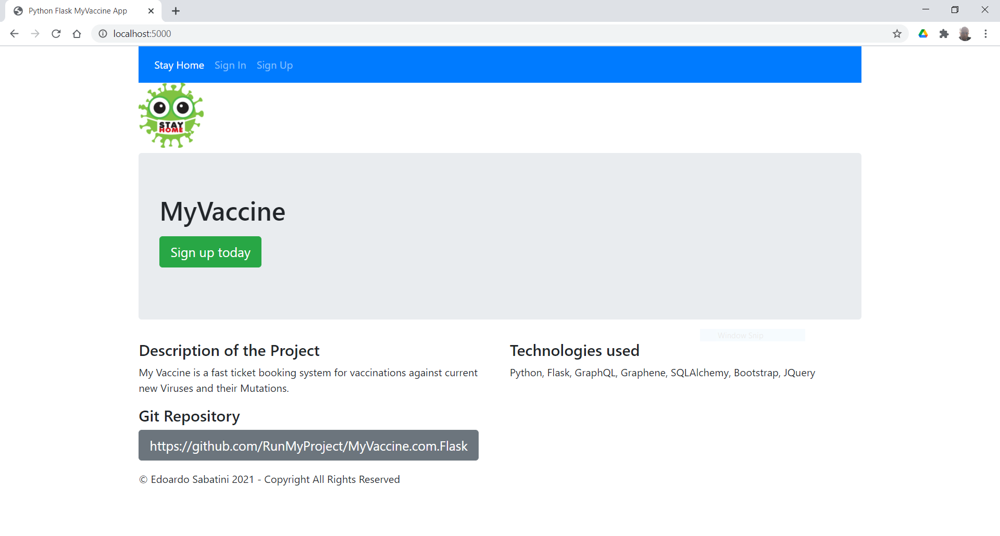

:python_version: current
:flask_version: current
:toc:
:project_id: myvaccine
:icons: font
:source-highlighter: prettify

= Welcome to MyVaccine!

- Description of the Project:

MyVaccine is a fast ticket booking system for vaccinations against current new Viruses and their Mutations.

The Project is based on Python 3.9 for Back-end and Flask 1.1. to manage the Front-end.
The Database is managed by GraphQL, Graphene and SQLAlchemy.
Front-end layout and control are developed in Bootstrap and JQuery.

- Stay Home Page

----
----

----
----

[[initial]]
== Set Up Python App

after downloading from git, install the following components with *pip* and *npm* :

- install Flask framework:

[subs="attributes"]
----
./cd MyVaccine.com.Flask
./pip install flask
----

- install GraphQL Database:

[subs="attributes"]
----
./npm init
./npm install graphql --save
----

- verify GraphQL Database with *node* :

[subs="attributes"]
----
./node server.js
----

- install Graphene db-framework:

[subs="attributes"]
----
./pip install "graphene>=2.0"
----

- install SQLAlchemy db-library:

[subs="attributes"]
----
./pip install SQLAlchemy
----

- install graphene_sqlalchemy library to join Graphene and SQLAlchemy:

[subs="attributes"]
----
./pip install graphene_sqlalchemy
----

- install Flask-GraphQL library to join GraphQL and Flask:

[subs="attributes"]
----
./pip install Flask-GraphQL
----

[[initial]]
== Start Up Python App

after installing the components run the following scripts:

- initialize the GraphQL database

[subs="attributes"]
----
./python initdatabase.py
----

- start the app 

[subs="attributes"]
----
./python app.py
----

and go to http://localhost:5000/

- you can always clean up the database!

[subs="attributes"]
----
./python cleandatabase.py
----

[[initial]]
== Description of the Architecture

[subs="attributes"]
----
TODO...!
----
